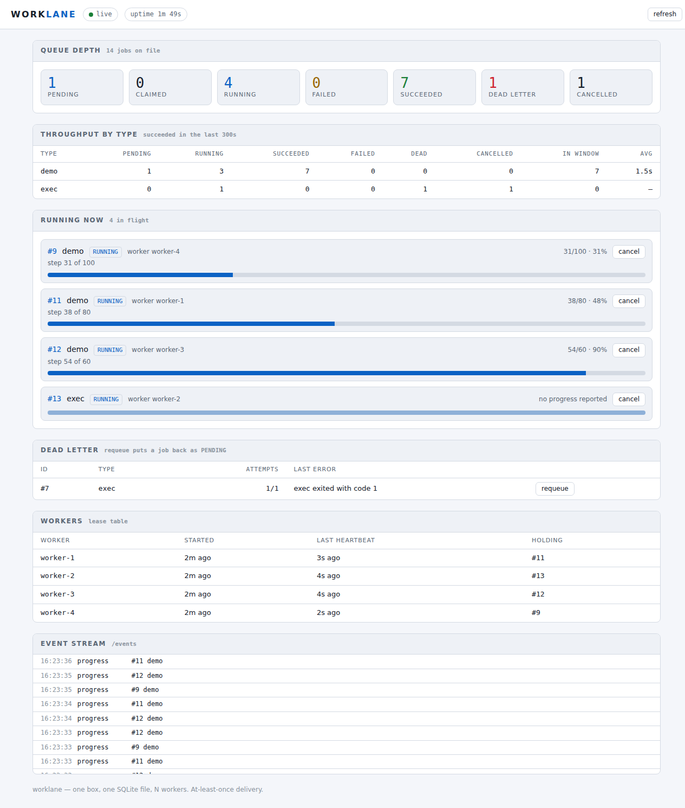

# worklane

A single-box durable job queue on SQLite with real workers, real cancel and a
live dashboard. One box, one SQLite file, N workers in one process, at-least-once
delivery.

## Quickstart

1. Install and build:

       pnpm install
       pnpm build

2. Start the server — with no config it uses built-in defaults (port 8080):

       node dist/server.js

   Or point it at a YAML config:

       node dist/server.js --config ./worklane.yaml

3. Open http://localhost:8080/ in a browser for the dashboard.

4. Queue a couple of demo jobs:

       curl -X POST http://localhost:8080/jobs \
         -H "Content-Type: application/json" \
         -d '{"type":"demo","payload":{"steps":20,"stepMs":250}}'

   Watch the progress bars move on the dashboard.

5. Cancel a running job:

       curl -X POST http://localhost:8080/jobs/<id>/cancel

   The reply carries a `signal` field telling you whether SIGTERM killed the
   process or it took SIGKILL.

## The HTTP surface

| Verb   | Path                    | What it does                                      |
|--------|-------------------------|---------------------------------------------------|
| POST   | /jobs                   | Enqueue a job of a given type with an optional payload. |
| GET    | /jobs                   | List jobs, newest first, with their current state.  |
| GET    | /jobs/:id               | Read one job by id, including its history.          |
| POST   | /jobs/:id/cancel        | Cancel a running or queued job.                     |
| POST   | /jobs/:id/requeue       | Requeue a dead-lettered or failed job.              |
| GET    | /healthz                | Liveness probe — always returns 200.                |
| GET    | /stats                  | Per-type throughput over a sliding window.          |
| GET    | /metrics                | Prometheus-format counters and histograms.          |
| GET    | /events                 | SSE stream of job-state events, replay buffer on connect. |
| GET    | /                       | The dashboard page — self-contained HTML, zero external requests. |

A configured bearer token is required on all routes except `/healthz` and `/`.
Send it as `Authorization: Bearer <token>`.

## Configuration

Copy `deploy/worklane.example.yaml` and edit. The server accepts config through
three channels, in precedence order: `--config <path>` (command-line flag), the
`WORKLANE_CONFIG` environment variable, and the built-in defaults.

The file is a flat map of `key: value` scalars — no nesting, no lists. Anything
else is a startup error naming the offending line.

## Deploying

A systemd unit ships in `deploy/worklane.service`. Point it at your YAML config
and a suitable `dbPath`, then `systemctl enable --now worklane`.

## Handlers

Register a handler for a job type and the queue dispatches to it. `exec` (run a
shell command) and `demo` (report incremental progress) ship with the project.
Write your own by implementing the handler interface and wiring it into the
runtime.

## Development

Three shell commands decide whether a session succeeded:

    pnpm typecheck
    pnpm test
    bash scripts/verify.sh

`verify.sh` runs all three plus a README quickstart lint.

## How this was built

This project was written end to end by an autonomous coding loop — a local 35B
model iterating over a `TODO.md` ledger, with a planning lane that authors each
phase. See `docs/PROCESS.md` for the full account.
